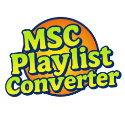

##  MSC Playlist Converter

### Overview
MSC Playlist Converter is a Python tool I made using AI designed to simplify the downloading and conversion of audio tracks from YouTube and SoundCloud (Unfortunately no Spotify due to DRM restrictions😔) into .ogg files for My Summer Car. The tool uses [yt-dlp](https://github.com/yt-dlp/yt-dlp) for downloading and includes [FFmpeg](https://ffmpeg.org/) for audio conversion.

## Usage
1. Open the application
2. Enter a YouTube or SoundCloud playlist/track link in the input field or select local audio files
3. Select the output (Radio, CD1, CD2, CD3)
4. Optionally enable "High Quality" for better audio (High quality .ogg files take a VERY LONG time to import in MSC!)
5. Click "Start" to begin the download and conversion process

### Converting Local Files
- Use the "Local Audio" button to select audio files
- All supported audio files will be converted and added to the selected output

### Output Modes
- **Radio**: Adds tracks to the car radio folder
- **CD1/CD2/CD3**: Creates custom CDs with cover art support
- **Single Track Mode**: When downloading individual tracks, they're added to existing collections

### Supported Formats
- **Input**: YouTube/SoundCloud URLs, Local audio files via "Local Audio" button
- **File Types**: MP3, WAV, OGG, FLAC, AAC, M4A

## Instalation

### Option 1: Download Executable
1. Download `MSCPlaylistConverter.exe` from the releases
2. Run the executable

### Option 2: Compile from Source
1. Install Python
- Download **Python 3.7 or higher** from [python.org](https://www.python.org/downloads/).  
- **Important:** During installation, check the box that says **"Add Python to PATH"**.

2. Download the source code
- Click the green **Code** button on this GitHub page and choose **Download ZIP**, then extract it.  
**Or** use `git` from the command line:
```bash
git clone https://github.com/Kaniasz/MSC-Playlist-Converter
cd MSC-Playlist-Converter
```

3. Install dependencies
Open **Command Prompt** or **PowerShell** inside the project folder and run:
```bash
pip install -r requirements.txt
pip install pyinstaller
```

4. Run without building an executable
```bash
python src/MSCPlaylistConverter.py
```

5. Build the executable
```bash
python build.py
```
The executable will be created in the `build/` folder.
